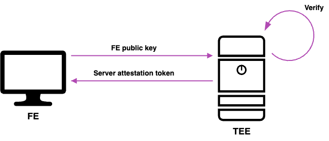

# Decentralized trusted AI

Project solution for the Verifiable AI Hackathon

## Application URLs

##### NOTICE: Before opening the application open the https://34.162.205.94/api/ in the browser and allow its self signed certificate.

| Application | URL                                   |
| ----------- | ------------------------------------- |
| Frontend    | https://verifiable-ai-data.vercel.app |
| Backend TEE | https://34.162.205.94/api             |

# Problem
AI models, while powerful, cannot be fully trusted due to the lack of transparency in verifying the trustworthiness of their answers. Current solutions to address this issue are centralized, requiring users to place their trust in a single entity for verification. This centralized approach undermines the very goal of building reliable and unbiased systems.

# Our Solution
To tackle these challenges, we propose a **decentralized system** for verifying the trustworthiness of AI-generated answers. Our approach allows anyone to participate in the verification process by writing answer hashes to a blockchain, ensuring transparency and trust.

### Key Components:
1. **Decentralized Verification:** Answer hashes are recorded on the blockchain, enabling anyone to verify them.  
2. **Trusted Execution Environment (TEE):** Large Language Models (LLMs) and a vector database operate within a secure TEE.  
3. **Secure Communication:** The front-end and TEE communicate securely using server attestation tokens.  
4. **Blockchain Integration:** Verification of answers is performed using transactions and read calls to the Flare blockchain.

Within the TEE, we separate **verified knowledge** from **unverified knowledge**. The LLM is instructed to decide which type of knowledge to use based on the query. Verified answers consistently return the same hashes, which can be independently verified on-chain for accuracy.

## Technical Brief
The solution uses 3 key components:  
- **Frontend (FE) Application:** A lightweight frontend chatbox for user interaction.  
- **Backend (BE) Application:** A backend running in Google's Trusted Execution Environment (TEE). This application securely operates the LLM model and vector database.  
- **Blockchain (BC) Smart Contract:** A smart contract deployed on the Flare network.  

### Secure Communication
To ensure secure communication between the FE and TEE, we use server attestation tokens:  
1. The frontend has its public key, which it sends to the TEE server.  
2. The TEE verifies this key and returns a server attestation token.  
3. The FE uses this attestation token for subsequent communications with the TEE, which verifies it with every request.

### Verification Process
The verification process involves comparing hashes:  
- A hash is calculated from the AI's output and compared with the hash stored on-chain.  
- If the hashes match, the verification is confirmed.  
- Similarly, users can provide trustworthiness by writing the hash to the blockchain themselves.

This approach ensures transparency, trustworthiness, and decentralization in verifying AI-generated answers.

TODO:// Add descpritipon, how llm and RAG works. 

# Future Plan
Our vision includes developing a **decentralized hub** where users can access trusted AI answers by paying small blockchain fees. To ensure the integrity of the system:

- **TEE Validation:** The TEE public key will be added to the blockchain to prove its validity.  
- **TEE Validation:** The TEE public key will be added to the blockchain to prove its validity.
- **Stake-Based Trust:** Users can stake assets to vouch for the correctness of the answers.  
- **Yield Generation:** Fees collected will generate yield, rewarding stakers for their contributions.  
- **Dispute Mechanism:** Staked assets can be challenged and potentially forfeited if proven incorrect through disputes.

This decentralized and trustless approach aims to revolutionize the way we verify AI-generated answers, ensuring transparency, reliability, and community participation.
